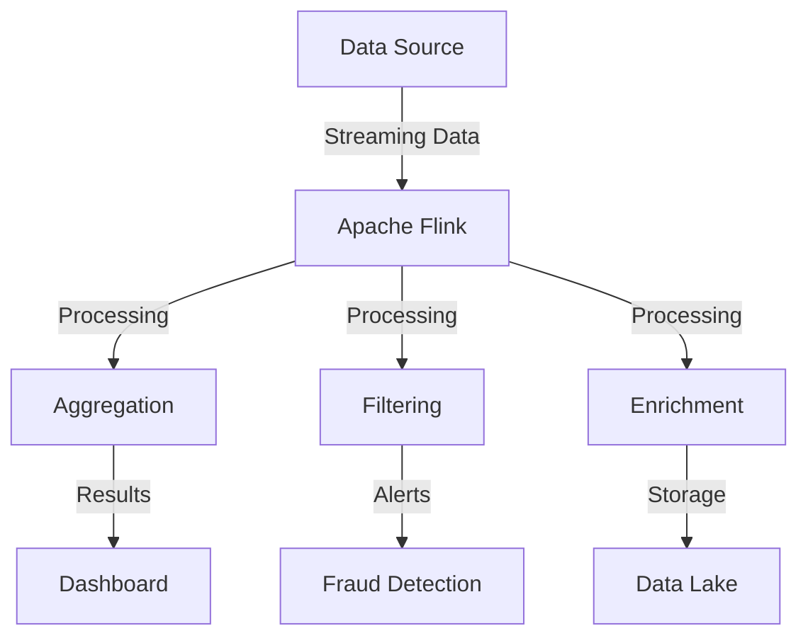
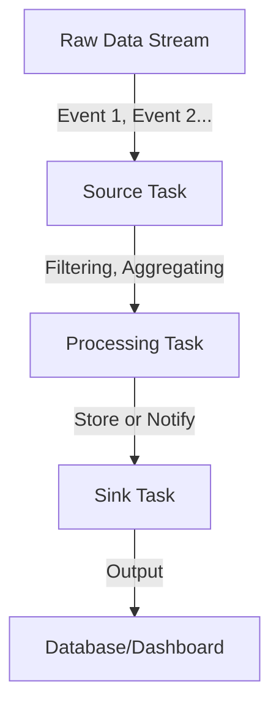

# ⚡ **Apache Flink – The Supercharged Stream Processing Engine!**

Welcome to **Apache Flink**, the **Ferrari** of real-time data processing! If you've ever wondered how companies process **huge amounts of streaming data in milliseconds**, Flink is the magic behind the scenes. Let’s break it down **simply** and **clearly**!

---

## 🔥 **What is Apache Flink?**

Imagine you're at a **fast-food restaurant** 🚀. Orders keep coming in **non-stop**, and the staff must **process them immediately**. If they wait for a full batch of orders before cooking, customers will **starve!** 🥲

Apache Flink works **the same way** for data. Instead of waiting for a full dataset (like batch processing), it processes **each event as it arrives**. This makes Flink perfect for **real-time analytics, fraud detection, monitoring, and more!**

✅ **Processes data in real-time** (millisecond latency).  
✅ **Distributed & fault-tolerant** (if a server crashes, it continues).  
✅ **Handles both streaming & batch processing** (flexible!).  
✅ **Exactly-once processing** (no duplicate or missing data).

---

## ⚙️ **How Apache Flink Works?**

Flink follows a **distributed architecture** where multiple machines work together. Here’s a **simple flow**:



1️⃣ **Data Source** → Comes from Kafka, Kinesis, databases, or logs.  
2️⃣ **Apache Flink** → Cleans, enriches, and transforms data.  
3️⃣ **Processing Tasks** → Aggregation, filtering, joins, and transformations.  
4️⃣ **Outputs** → Results go to dashboards, databases, alerts, or data lakes.

---

## 🏆 **Key Features of Apache Flink**

| Feature                     | Why It’s Awesome                                                            |
| --------------------------- | --------------------------------------------------------------------------- |
| **True Streaming**          | Processes data **event-by-event** (not micro-batches like Spark Streaming). |
| **Exactly-Once Processing** | Guarantees **no data loss** or duplication.                                 |
| **Event Time Processing**   | Uses the **actual event timestamp**, not when data arrives.                 |
| **Fault Tolerant**          | If a node **crashes**, Flink **recovers automatically**.                    |
| **Scalability**             | Handles **millions of events per second** across many nodes.                |
| **Low Latency**             | Processes data **within milliseconds**.                                     |

---

## 🛠 **Where is Apache Flink Used?**

🔹 **Fraud Detection** 🏦 → Banks detect **suspicious transactions in real time**.  
🔹 **E-Commerce Analytics** 🛒 → Amazon & Shopify track **customer behavior live**.  
🔹 **IoT & Sensors** 🌡️ → Smart devices **analyze real-time temperature changes**.  
🔹 **Stock Market Alerts** 📈 → React to **market changes instantly**.  
🔹 **Ad Tech** 📊 → Google & Facebook optimize **ads based on user interactions**.

---

## 🚀 **How Does Flink Process Data?**

Apache Flink **organizes data** into **streams** and **tasks**. Think of it like a **water pipeline** where different sections **filter, transform, and analyze data**.



1️⃣ **Source Task** – Reads incoming data from **Kafka, Kinesis, or S3**.  
2️⃣ **Processing Task** – Cleans, filters, and transforms the data.  
3️⃣ **Sink Task** – Saves results to **databases, dashboards, or alerts**.

---

## 💬 Example: Real-Time Order Pipeline

Imagine streaming order updates from Kafka:

```txt
order-1-placed
order-1-shipped
order-1-delivered
order-2-placed
order-2-shipped
```

Flink consumes each **immediately** as it arrives:

1. `map()` to enrich data
2. `keyBy(order_id)` to group by order
3. `process()` or `window()` to track lifecycle
4. `sink()` to store or notify downstream systems

**No waiting. No batch.** Just pure live data flow 🔥

---

## 🎯 **Flink vs. Other Streaming Engines**

| Feature             | Apache Flink                   | Apache Spark Streaming | Kafka Streams           |
| ------------------- | ------------------------------ | ---------------------- | ----------------------- |
| **Processing Type** | True **event-based** streaming | Micro-batch processing | Record-by-record        |
| **Latency**         | **Milliseconds**               | Seconds                | Milliseconds            |
| **Fault Tolerance** | Checkpoints & state snapshots  | RDD recovery           | Uses Kafka's durability |
| **Use Case**        | Complex stream processing      | Batch + Streaming      | Light-weight streaming  |

👉 **Flink is best** when you need **low latency** and **exactly-once processing**.

---

## 🛠 **Getting Started with Flink** (Hands-on!)

Let’s process **real-time sensor data** with Flink using Python:

### **1️⃣ Install Flink**

```sh
wget https://dlcdn.apache.org/flink/flink-1.16.0-bin-scala_2.12.tgz
tar -xvzf flink-1.16.0-bin-scala_2.12.tgz
cd flink-1.16.0
./bin/start-cluster.sh
```

### **2️⃣ Create a Simple Flink Job**

```python
from pyflink.datastream import StreamExecutionEnvironment

env = StreamExecutionEnvironment.get_execution_environment()
data_stream = env.from_collection(["sensor-1: 22°C", "sensor-2: 24°C"])
data_stream.print()
env.execute("Simple Flink Job")
```

### **3️⃣ Run the Job**

```sh
python flink_script.py
```

📌 **Output:**

```txt
sensor-1: 22°C
sensor-2: 24°C
```

🔥 **Congratulations! You just ran your first Flink program!** 🎉

---

## ⚠️ **Challenges with Flink**

| Problem                    | Solution                                                                |
| -------------------------- | ----------------------------------------------------------------------- |
| **High Learning Curve** 📚 | Start with **basic transformations** before tackling complex pipelines. |
| **Cluster Management** 🏗️  | Use **Kubernetes or AWS Flink** for easier scaling.                     |
| **Memory Consumption** 💾  | Optimize **stateful applications** to avoid excessive RAM usage.        |

---

## 🎯 **Final Thoughts – Why Flink?**

✅ **Best-in-class real-time streaming** → **Low-latency, scalable, and exactly-once processing.**  
✅ **Widely used in finance, IoT, e-commerce, and analytics.**  
✅ **Easy integration with Kafka, Kinesis, S3, and databases.**  
✅ **Open-source & cloud-native** → Available in **AWS, GCP, and Azure**.

🚀 **If you need real-time analytics, Apache Flink is the tool to master!** Now go **experiment with streaming data!** 🎉
