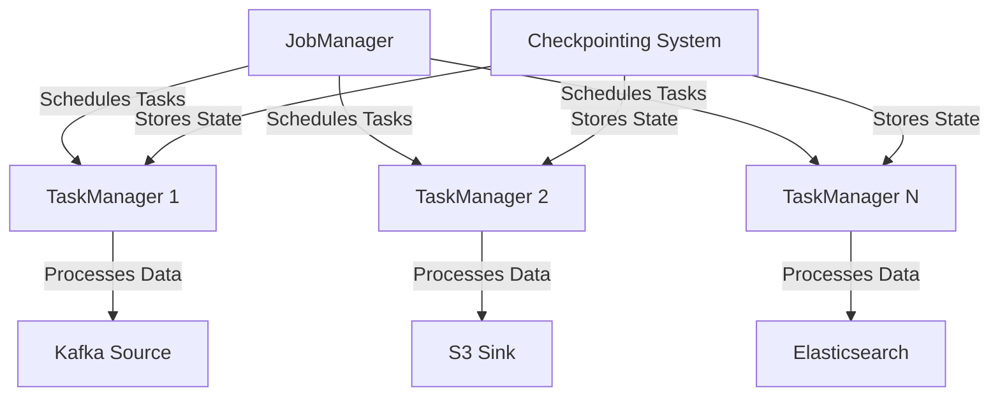
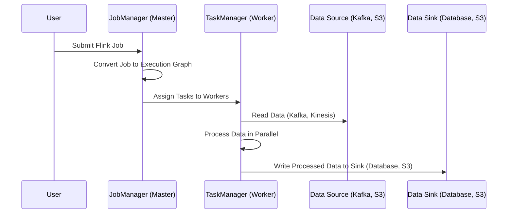
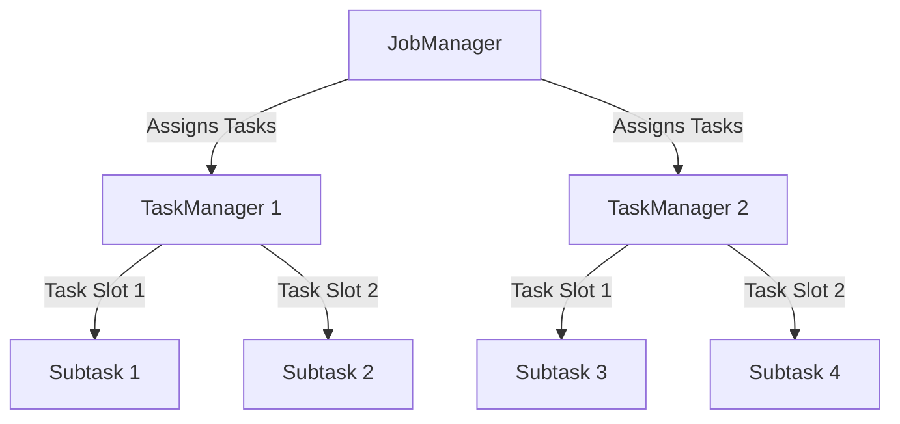
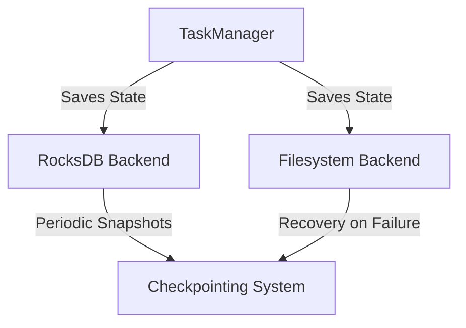

# 🚀 **Apache Flink Internals – Deep Dive into the Streaming Powerhouse!**

Apache Flink is **one of the most powerful distributed stream processing engines**, but how does it actually work under the hood? 🤔 Let’s **demystify** Flink’s architecture, components, and execution model with **simple explanations** and **visual diagrams**. 🎨

---

## 🎯 **Apache Flink Architecture Overview**

Apache Flink follows a **master-worker architecture** where different components work together to ensure **high availability, fault tolerance, and scalability**.

🔹 **JobManager (Master)** – Coordinates tasks & manages execution.  
🔹 **TaskManagers (Workers)** – Execute tasks & process data.  
🔹 **Checkpoints & State Backend** – Ensure fault tolerance.  
🔹 **Sources & Sinks** – Handle input and output streams.

### **🔧 Flink's High-Level Architecture**



💡 **Key Takeaways:**  
✅ **JobManager** distributes work to **TaskManagers**.  
✅ **TaskManagers** execute parallel **subtasks**.  
✅ **State Backend** stores **snapshots** for recovery.

---

## 🔥 **Key Components of Apache Flink**

Let’s break down Flink’s **core components**:

| Component           | Role                                                                                      |
| ------------------- | ----------------------------------------------------------------------------------------- |
| **JobManager**      | The **brain** of Flink. It manages jobs, schedules tasks, and monitors execution.         |
| **TaskManager**     | The **worker nodes** that execute tasks in parallel.                                      |
| **Execution Graph** | A **logical plan** that Flink generates from the user’s program.                          |
| **Task Slots**      | A **unit of parallelism** that defines how many tasks a TaskManager can run.              |
| **State Backend**   | A **storage mechanism** for maintaining application state (RocksDB, Heap, or Filesystem). |
| **Checkpoints**     | A **fault-tolerance mechanism** that saves Flink's progress.                              |

---

## ⚙️ **How Apache Flink Works?**

### **1️⃣ Flink Job Lifecycle**

When you submit a Flink job, **four major steps** happen:



📌 **What happens?**  
1️⃣ **User submits a job** → Flink compiles it into an **execution graph**.  
2️⃣ **JobManager schedules tasks** → Assigns them to **TaskManagers**.  
3️⃣ **TaskManagers execute tasks in parallel** → Read from sources, process data, and write to sinks.

---

### **2️⃣ Parallelism & Task Slots 🏎️**

🔹 In Flink, each **TaskManager** has **multiple task slots**, allowing multiple tasks to run concurrently.  
🔹 Each **parallel subtask** processes a portion of the data stream.



💡 **Key Insights:**  
✅ **Parallelism controls how many subtasks run concurrently.**  
✅ **More TaskManagers = More processing power.**  
✅ **Task Slots define resource allocation per worker.**

---

### **3️⃣ State Management & Checkpointing 💾**

Apache Flink maintains **stateful processing**, meaning it **remembers past events**.

🔹 **Example: Fraud Detection System**

- A bank detects fraudulent transactions over a **5-minute window**.
- Flink needs to store **transactions temporarily** to check for suspicious patterns.

🔹 **How Flink Handles State:**

- Stores state in **RocksDB, heap memory, or filesystem**.
- Uses **incremental checkpoints** to avoid data loss.



📌 **Key Benefits of State Management:**  
✅ **Exactly-once guarantees** → No duplicate/missing events.  
✅ **Efficient window-based aggregations**.  
✅ **Fast recovery from failures**.

---

### **4️⃣ Flink DataStream API – Processing in Action!**

Flink provides **low-level APIs** for complex event processing.

#### **🚀 Example: Detecting Temperature Spikes in IoT Sensors**

```python
from pyflink.datastream import StreamExecutionEnvironment

env = StreamExecutionEnvironment.get_execution_environment()
data_stream = env.from_collection([
    ("sensor-1", 22), ("sensor-1", 30), ("sensor-2", 40)
])

def filter_high_temp(sensor):
    return sensor[1] > 25  # Only keep high temperatures

filtered_stream = data_stream.filter(filter_high_temp)
filtered_stream.print()
env.execute("Temperature Monitor")
```

💡 **What’s Happening?**  
✅ **Streaming sensor data** is ingested.  
✅ **Flink filters records where temperature > 25°C.**  
✅ **Results are printed (or sent to a database).**

---

## 🔄 **Batch Processing vs Streaming in Flink**

| Feature             | Batch Processing (Spark, Hadoop) | Streaming (Flink)          |
| ------------------- | -------------------------------- | -------------------------- |
| **Latency**         | High (minutes/hours)             | Low (milliseconds)         |
| **Data Handling**   | Entire dataset at once           | Continuous data flow       |
| **Use Case**        | Historical analytics             | Real-time fraud detection  |
| **Fault Tolerance** | Checkpoints on batch             | Continuous state snapshots |

💡 **Flink is unique** because it can **do both batch & streaming!**

---

## 🛠️ **When Should You Use Apache Flink?**

✅ **Real-time analytics (stock market, e-commerce, IoT).**  
✅ **Fraud detection (credit card transactions).**  
✅ **Monitoring & alerting (server logs, anomaly detection).**  
✅ **Log processing (search engines, observability tools).**

---

## 🎯 **Final Thoughts – Why Flink Rocks!**

✅ **Super-fast real-time processing** (low-latency).  
✅ **Distributed, scalable, and fault-tolerant**.  
✅ **Handles massive event streams (IoT, logs, finance, ads).**  
✅ **Exactly-once guarantees ensure data correctness.**

🚀 **Flink is a game-changer for streaming!** If you're building real-time apps, it's a must-learn.

🔥 **Now go run some Flink jobs and see it in action!** 🎉
