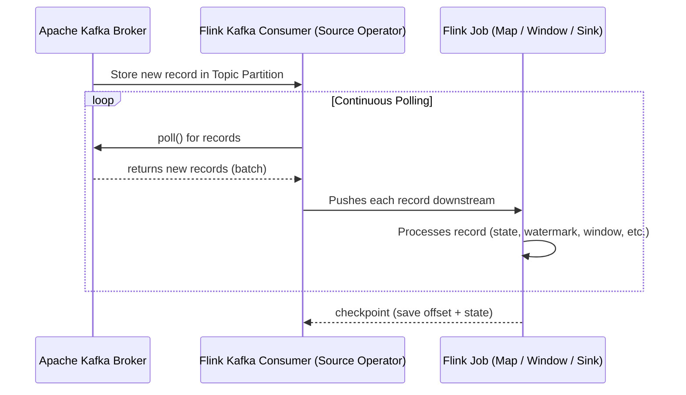
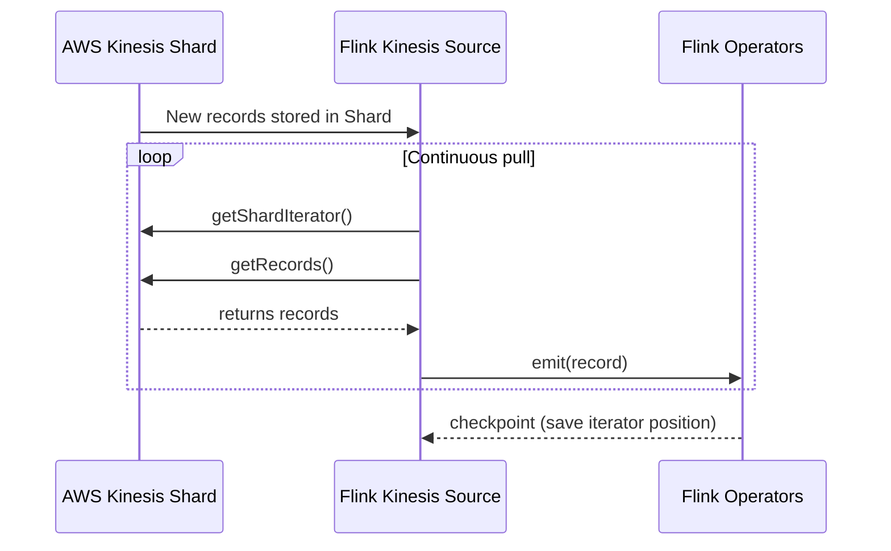

# ⚡ **How Apache Flink Is So Fast!**

## 🚪 Is Apache Flink Push or Pull?

| Source                   | Is It Push-Based? | Is It Pull-Based? | Notes                                    |
| ------------------------ | ----------------- | ----------------- | ---------------------------------------- |
| **Apache Kafka**         | ❌ No             | ✅ **Yes**        | Uses Kafka Consumer API                  |
| **Amazon Kinesis (KDS)** | ❌ No             | ✅ **Yes**        | Uses GetRecords API with shard iterators |

> 🔥 **Bottom Line:** Flink uses **pull-based mechanisms** for both Kafka and Kinesis.  
> But the pull happens **continuously and efficiently** — so fast that it _feels_ like streaming push.

---

## 🧠 **Why It's Pull-Based**

### Kafka Connector (Flink ↔ Kafka)

- Flink uses **KafkaConsumer**, a native client from Kafka libraries.
- It subscribes to topics and **polls** for new data in a **loop** using `poll()` method.
- Flink maintains **offsets internally** and commits them via checkpointing.

### Kinesis Connector (Flink ↔ Kinesis)

- Flink uses the **Kinesis Client Library (KCL)** or enhanced Flink connectors.
- KCL requests **ShardIterator**, then uses `getRecords()` on a loop.
- Also **pull-based**, but with its own checkpointing and retry logic.

---

## 🤔 **But Why Does It Feel Like Push?**

Because **Flink pulls in a tight loop**, and as soon as a record is available, it:

**💥 it's like an infinite loop.**  
But… it's a _very smart, efficient, non-blocking_, and _event-driven infinite loop_.

Let’s break it down again in a **developer-friendly analogy** 🎯

---

### 🔁 Flink’s Source Connector = Infinite Polling Loop

Imagine this:

```csharp
while (true)
{
    var records = kafka.poll(Duration.ofMillis(100)); // Pull new data
    for (record in records) {
        process(record); // Send downstream for processing
    }
    if (checkpointTime) {
        saveOffsets();
    }
}
```

- This is **conceptually** what Flink’s Kafka/Kinesis source connectors are doing internally.
- They poll continuously, buffer smartly, and **emit each record ASAP** to the job's processing pipeline.
- Think of it as:
  - 🔄 An **infinite loop**
  - 👂 That's always listening for **new messages**
  - 🚀 And immediately hands them off for **real-time processing**

---

### 🧠 But It’s Smarter Than a Dumb Loop

Unlike a naive infinite loop, Flink’s loop is:

- 💤 **Non-blocking** — It doesn’t waste CPU if there are no new records.
- 📦 **Buffered** — It fetches multiple records in one go (batch fetch, not batch processing!).
- 🧩 **Parallelized** — Different partitions (Kafka) or shards (Kinesis) have separate subtasks pulling independently.
- 💡 **State-aware** — It checkpoints offsets and internal state atomically.
- 📉 **Backpressure-aware** — If downstream can’t keep up, it slows down gracefully.

---

## 🔄 **High-Level Flow: Flink + Kafka/Kinesis**



---



---

## 🧰 **Protocols and Communication**

| System      | Protocol Used        | Details                                        |
| ----------- | -------------------- | ---------------------------------------------- |
| **Kafka**   | TCP (Kafka protocol) | Uses Kafka Java client, talks to brokers       |
| **Kinesis** | HTTPS / AWS SDK      | Uses `GetRecords`, `GetShardIterator` via HTTP |

> ⚠️ **No WebSocket or push channel involved.**

- Kafka doesn’t support server-initiated push.
- Kinesis also requires you to ask for records using `getRecords()`.

---

## 💡 **Flink Loop vs Spark Micro-batch**

| Feature   | **Flink**                         | **Spark Structured Streaming**         |
| --------- | --------------------------------- | -------------------------------------- |
| Trigger   | Event-driven (record arrives)     | Timer-driven (process every N seconds) |
| Latency   | Low (ms)                          | Higher (seconds, micro-batch delay)    |
| Loop Type | Continuous pull loop              | Batching loop                          |
| Best for  | Real-time alerts, fraud detection | Aggregation, hourly dashboards         |

---

## 🗣️ **TL;DR for Devs**

Yes — Flink is basically a **supercharged `while(true)`** loop that:

- Pulls data from Kafka/Kinesis every few milliseconds
- Instantly pushes it into the job graph (map/filter/window/whatever)
- Tracks offsets/checkpoints internally
- Handles millions of events per second **with low latency**

## 🏁 **Summary**

🔥 It’s the “pull-loop that _feels_ like push”.

| Question                         | Answer                                                                       |
| -------------------------------- | ---------------------------------------------------------------------------- |
| Is Flink push-based?             | ❌ No                                                                        |
| Is it pull-based?                | ✅ Yes (Kafka/Kinesis SDK polling loop)                                      |
| Does it use WebSocket?           | ❌ No, it's TCP for Kafka and HTTPS for Kinesis                              |
| Why is it so fast?               | Because it polls in a non-blocking, continuous, and highly efficient loop    |
| Can I control polling frequency? | Not directly — Flink connector handles it for max throughput and low latency |
| Where is offset stored?          | ✅ In Flink’s checkpointed state, not in Kafka or Kinesis by default         |
