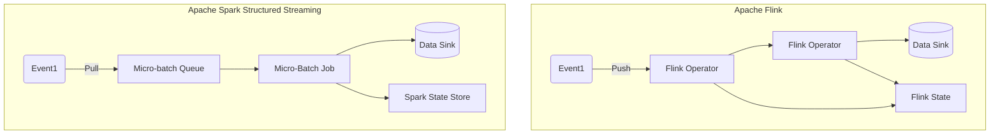

# 🔥 Apache Flink vs Apache Spark

Both **Apache Flink** and **Apache Spark** are powerful, open-source frameworks for **data processing at scale**, but they shine in different areas — especially when it comes to **streaming**.

Let’s break it all down!

---

## 🧠 High-Level Concept

| Feature               | Apache Flink 🟢                   | Apache Spark 🟡                      |
| --------------------- | --------------------------------- | ------------------------------------ |
| Primary Focus         | True stream processing            | Micro-batch streaming                |
| Processing Model      | Event-at-a-time (record-based)    | Mini-batches of events               |
| Latency               | Milliseconds (real-time)          | Seconds (near real-time)             |
| Backpressure Handling | Native & built-in                 | Manual tuning often required         |
| APIs                  | DataStream, Table, SQL            | RDD, DataFrame, Structured Streaming |
| Windowing             | Natively supports complex windows | Supported, but more rigid            |
| Fault Tolerance       | Lightweight checkpointing         | Checkpointing + WAL                  |
| Event Time Support    | First-class citizen (Watermarks)  | Supported, not as seamless           |

---

## 💡 Real-World Analogy

Imagine a **burger restaurant** 🍔 that takes online orders.

- **Apache Flink** is like a chef who makes each burger **as soon as** an order arrives — **instant, real-time**.
- **Apache Spark** waits to collect **a batch of 10 orders**, then starts cooking them together — **near real-time**.

Both can serve burgers 🍔. But one reacts immediately (Flink), the other processes in rounds (Spark).

---

## 🛠️ Processing Model Internals

### 🟢 Apache Flink: _True Real-Time (Record-Based)_

- Flink reacts **immediately** to each incoming event.
- It has a **push-pull hybrid** model using asynchronous, continuous communication between operators.
- Designed as an **event-driven runtime**.
- Checkpoints the internal state for fault tolerance, exactly-once semantics.

### 🟡 Apache Spark: _Micro-Batch Processing_

- Spark breaks time into **fixed intervals** (e.g., every 5 seconds), collects events, and processes them as a batch.
- It's **not truly real-time** — there’s always some delay.
- Excellent for **batch + stream hybrid** workloads (aka Lambda architecture).

---

## 📦 Supported Data Sources

| Source Type      | Apache Flink       | Apache Spark           |
| ---------------- | ------------------ | ---------------------- |
| Kafka            | ✅ Native & robust | ✅ Strong support      |
| Kinesis          | ✅ via Connector   | ✅ via Spark Connector |
| Files (S3, HDFS) | ✅                 | ✅                     |
| JDBC             | ✅                 | ✅                     |

---

## 🚀 Architecture Diagram

---

## ⏱️ Latency: Why Flink Wins for Real-Time

- Flink is designed for **low-latency** from the ground up.
- Each record triggers processing — no waiting.
- Spark has to **wait for the mini-batch to fill**, causing latency.

---

## 🔄 Fault Tolerance and State Management

| Feature       | Apache Flink          | Apache Spark                    |
| ------------- | --------------------- | ------------------------------- |
| State Backend | RocksDB, Memory       | Memory, Disk                    |
| Checkpoints   | Lightweight, frequent | More resource-intensive         |
| Recovery      | Fast and fine-grained | Slower for streaming            |
| Exactly-once  | ✅ Native             | ✅ Supported, but complex setup |

---

## 📊 When to Use What?

| Use Case                             | Recommended Engine |
| ------------------------------------ | ------------------ |
| Realtime fraud detection             | 🟢 Flink           |
| ETL Pipelines (low latency)          | 🟢 Flink           |
| Near-real-time dashboards            | 🟡 Spark           |
| Large-scale batch + stream combo     | 🟡 Spark           |
| Streaming joins and event time logic | 🟢 Flink           |
| You already have a Spark ecosystem   | 🟡 Spark           |

---

## 🧪 Summary

| Category              | Flink     | Spark            |
| --------------------- | --------- | ---------------- |
| Real-Time Streaming   | ✅        | ❌ (Micro-batch) |
| Batch Processing      | ✅        | ✅               |
| Unified Engine        | ✅        | ✅               |
| Learning Curve        | Medium    | Medium           |
| Integration Ecosystem | Great     | Excellent        |
| Fault Tolerance       | Excellent | Great            |
| Event Time Support    | Native    | Available        |
| Latency               | < 100ms   | > 500ms          |

---

## ✅ Final Thoughts

> 🔥 **If milliseconds matter — go Flink.**  
> ⚙️ **If you love batch and are okay with ~1s latency — go Spark.**  
> 🎯 Both are great — choose based on **latency needs**, **ecosystem**, and **operational complexity**.

---

Would you like a printable PDF version of this? Or maybe a cheat sheet version? Let me know!
